# 🏦 Basel Capital Engine

<div align="center">


**A comprehensive, open-source regulatory capital calculation engine implementing the Basel III framework for banking institutions**

[🚀 Quick Start](#-quick-start) • [📊 Features](#-features) • [🧮 Theory](#-basel-iii-theoretical-framework) • [🏗️ Architecture](#️-system-architecture) • [📚 Documentation](#-documentation)

</div>

---

## 🎯 Overview

The Basel Capital Engine is a production-ready implementation of the Basel III regulatory framework, providing banks, regulators, and researchers with accurate capital adequacy calculations, stress testing capabilities, and comprehensive risk analytics. Built with modern Python practices and designed for both educational and practical applications.

### 🌟 **Comprehensive Regulatory Platform**

```mermaid
graph TB
    subgraph "📥 DATA INPUT"
        A1[📊 Portfolio Data]
        A2[💰 Capital Structure]
        A3[🌊 Liquidity Data]
        A4[⚙️ Configuration]
    end
    
    subgraph "🔥 CORE ENGINES"
        B1[⚖️ Basel III Engine]
        B2[💳 IFRS 9 Calculator]
        B3[🌊 Liquidity Manager]
        B4[🔍 ICAAP Processor]
    end
    
    subgraph "📊 INTEGRATED ANALYTICS"
        C1[📈 Capital Ratios]
        C2[💰 ECL Provisions]
        C3[🌊 LCR/NSFR Ratios]
        C4[🎯 Pillar 2 Assessment]
    end
    
    subgraph "📋 REGULATORY OUTPUTS"
        D1[📄 COREP Reports]
        D2[📊 Stress Test Results]
        D3[🎯 ICAAP Documentation]
        D4[📈 Management Dashboard]
    end
    
    A1 --> B1
    A1 --> B2
    A2 --> B1
    A3 --> B3
    A4 --> B4
    
    B1 --> C1
    B2 --> C2
    B3 --> C3
    B4 --> C4
    
    C1 --> D1
    C2 --> D1
    C3 --> D2
    C4 --> D3
    
    B1 --> D2
    B2 --> D4
    B3 --> D4
    B4 --> D4
    
    style A1 fill:#4CAF50,stroke:#2E7D32,stroke-width:3px,color:#FFFFFF
    style A2 fill:#2196F3,stroke:#1565C0,stroke-width:3px,color:#FFFFFF
    style A3 fill:#00BCD4,stroke:#0097A7,stroke-width:3px,color:#FFFFFF
    style A4 fill:#FF9800,stroke:#F57C00,stroke-width:3px,color:#FFFFFF
    
    style B1 fill:#E91E63,stroke:#C2185B,stroke-width:3px,color:#FFFFFF
    style B2 fill:#9C27B0,stroke:#7B1FA2,stroke-width:3px,color:#FFFFFF
    style B3 fill:#00BCD4,stroke:#0097A7,stroke-width:3px,color:#FFFFFF
    style B4 fill:#FF5722,stroke:#D84315,stroke-width:3px,color:#FFFFFF
    
    style C1 fill:#8BC34A,stroke:#689F38,stroke-width:3px,color:#FFFFFF
    style C2 fill:#FFC107,stroke:#FFA000,stroke-width:3px,color:#000000
    style C3 fill:#00BCD4,stroke:#0097A7,stroke-width:3px,color:#FFFFFF
    style C4 fill:#FF5722,stroke:#D84315,stroke-width:3px,color:#FFFFFF
    
    style D1 fill:#607D8B,stroke:#455A64,stroke-width:3px,color:#FFFFFF
    style D2 fill:#795548,stroke:#5D4037,stroke-width:3px,color:#FFFFFF
    style D3 fill:#9E9E9E,stroke:#616161,stroke-width:3px,color:#FFFFFF
    style D4 fill:#3F51B5,stroke:#303F9F,stroke-width:3px,color:#FFFFFF
```



## 📊 Features

### 🔢 **Core Calculations**
- **Complete Basel III Implementation**: CET1, AT1, T2 capital with full regulatory adjustments
- **Risk-Weighted Assets (RWA)**: Credit, Market, and Operational risk calculations
- **Capital Ratios**: Basel Ratio, CET1 Ratio, Tier 1 Ratio, Leverage Ratio
- **Regulatory Buffers**: Conservation, Countercyclical, G-SIB, and D-SIB buffers
- **Stress Testing**: Macro scenario simulation with comprehensive impact analysis

### 💳 **IFRS 9 Integration**
- **Expected Credit Loss (ECL)**: 3-stage classification with automated provisioning
- **Stage Transition Analysis**: Automatic classification based on credit deterioration
- **Model Validation**: ECL model performance validation against actual losses
- **Accounting-Regulatory Bridge**: Consistent PD/LGD/EAD across Basel III and IFRS 9

### ⚖️ **Liquidity Risk Management**
- **Liquidity Coverage Ratio (LCR)**: Complete Basel III liquidity framework
- **High Quality Liquid Assets (HQLA)**: Level 1, 2A, 2B classification with haircuts
- **Net Stable Funding Ratio (NSFR)**: Long-term liquidity assessment
- **Liquidity Gap Analysis**: Maturity bucket analysis and stress testing

### 🔍 **ICAAP & Pillar 2**
- **Internal Capital Adequacy Assessment**: Comprehensive Pillar 1 + Pillar 2 integration
- **Concentration Risk**: Single-name, sector, and geographic concentration analysis
- **Interest Rate Risk Banking Book (IRRBB)**: Duration gap and economic value impact
- **Business Model Risk**: Revenue concentration and strategic risk assessment
- **Capital Planning**: Forward-looking capital projections and stress scenarios

### 📋 **Regulatory Reporting**
- **COREP Generation**: Automated European supervisory reporting
- **FINREP Support**: Financial reporting framework integration
- **XBRL Export**: Regulatory taxonomy-compliant output formats
- **Cross-Validation**: Automated consistency checks across report tables

### 🛠️ **Technical Features**
- **Multiple Interfaces**: Python library, REST API, CLI, and interactive web dashboard
- **Synthetic Data Generator**: Realistic portfolio generation for testing and demonstrations
- **Explainable Results**: Detailed breakdown and waterfall analysis of all calculations
- **Property-Based Testing**: Extensive test suite ensuring calculation consistency
- **Configuration-Driven**: Flexible parameter customization via YAML configuration

### 🌐 **Integration & Deployment**
- **Docker Support**: Containerized deployment with Docker Compose
- **API-First Design**: RESTful API with OpenAPI documentation
- **Real-Time Dashboard**: Interactive Streamlit interface with live calculations
- **Export Capabilities**: JSON, CSV, PDF, and XBRL report generation

---

## 🧮 Basel III Theoretical Framework

### 📋 **Regulatory Capital Structure**

Basel III defines a three-tier capital structure designed to ensure banks maintain adequate loss-absorbing capacity:


### 🎯 **Capital Adequacy Ratios**

The framework establishes minimum capital requirements through four key ratios:

```mermaid
graph LR
    A[Capital Ratios] --> B[CET1 Ratio<br/>≥ 4.5%]
    A --> C[Tier 1 Ratio<br/>≥ 6.0%]
    A --> D[Total Capital Ratio<br/>≥ 8.0%]
    A --> E[Leverage Ratio<br/>≥ 3.0%]
    
    B --> F[CET1 Capital ÷ RWA]
    C --> G[Tier 1 Capital ÷ RWA]
    D --> H[Total Capital ÷ RWA]
    E --> I[Tier 1 Capital ÷<br/>Total Exposure]
    
    style B fill:#2E7D32,stroke:#1B5E20,stroke-width:3px,color:#FFFFFF
    style C fill:#F57C00,stroke:#E65100,stroke-width:3px,color:#FFFFFF
    style D fill:#D32F2F,stroke:#B71C1C,stroke-width:3px,color:#FFFFFF
    style E fill:#7B1FA2,stroke:#4A148C,stroke-width:3px,color:#FFFFFF
```



### ⚖️ **Risk-Weighted Assets (RWA) Framework**

RWA calculations form the denominator of capital ratios and represent the bank's risk exposure:


### 🛡️ **Regulatory Buffers System**

Basel III introduces additional capital buffers above minimum requirements:


---

## 🏗️ System Architecture

### 🔄 **Calculation Flow**

The engine follows a systematic approach to capital adequacy calculations:


### 🏛️ **Module Architecture**


---

## 🚀 Quick Start

### 📦 Installation

```bash
# Create virtual environment
python -m venv venv
source venv/bin/activate  # On Windows: venv\Scripts\activate

# Install dependencies
pip install -r requirements.txt

# Install in development mode
pip install -e .
```

### 🔧 Basic Usage

```python
from basileia import (
    BaselEngine, PortfolioGenerator, Capital,
    IFRS9Calculator, LCRCalculator, ICAAProcessor, COREPGenerator
)

# 1. Generate synthetic portfolio
generator = PortfolioGenerator()
portfolio = generator.generate_bank_portfolio(size="medium")

# 2. Define capital structure
capital = Capital(
    common_shares=1_000_000,
    retained_earnings=500_000,
    at1_instruments=200_000,
    t2_instruments=300_000
)

# 3. Basel III calculations
basel_engine = BaselEngine()
basel_results = basel_engine.calculate_all_metrics(portfolio, capital)

print(f"Basel Ratio: {basel_results.total_capital_ratio:.2%}")
print(f"CET1 Ratio: {basel_results.cet1_ratio:.2%}")
print(f"Total RWA: €{basel_results.total_rwa:,.0f}")

# 4. IFRS 9 Expected Credit Loss
ifrs9_calc = IFRS9Calculator()
ecl_results = ifrs9_calc.calculate_portfolio_ecl(portfolio)
ecl_summary = ifrs9_calc.calculate_ecl_summary(portfolio)

print(f"Total ECL: €{ecl_summary['total_ecl']:,.0f}")
print(f"Coverage Ratio: {ecl_summary['overall_coverage_ratio']:.2%}")

# 5. ICAAP Assessment
icaap_processor = ICAAProcessor()
business_data = {'total_assets': 10_000_000, 'revenue_breakdown': {...}}
icaap_result = icaap_processor.comprehensive_assessment(
    portfolio, capital, business_data
)

print(f"Capital Adequacy: {icaap_result.assessment_level.value.upper()}")
print(f"Pillar 2 Add-on: €{icaap_result.pillar2_total_add_on:,.0f}")

# 6. Regulatory Reporting
corep_generator = COREPGenerator(basel_engine)
institution_info = {'institution_code': 'BANK001', 'institution_name': 'Sample Bank'}
corep_report = corep_generator.generate_corep_report(
    portfolio, capital, institution_info
)

print(f"COREP Report generated: {corep_report.institution_name}")
```

### 🌐 REST API Server

The Basel Capital Engine provides a comprehensive REST API with OpenAPI documentation:

```bash
# Start the API server
PYTHONPATH=src uvicorn api.main:app --host 0.0.0.0 --port 8000 --reload

# API Documentation available at: http://localhost:8000/docs
```

#### 📋 **Core API Endpoints**

```bash
# Health Check
GET /health
# Returns: {"status": "healthy", "timestamp": "...", "checks": {...}}

# Portfolio Analysis
POST /portfolio
# Calculate complete Basel III metrics for a portfolio
# Returns: Basel ratios, RWA breakdown, buffer analysis

# Stress Testing
POST /stress-test
# Run stress scenarios on portfolio
# Returns: Baseline vs stressed metrics, buffer breaches

# IFRS 9 ECL Calculation
POST /ifrs9/ecl
# Calculate Expected Credit Loss provisions
# Returns: ECL by stage, coverage ratios, provision requirements

# Liquidity Analysis
POST /liquidity/lcr
# Calculate Liquidity Coverage Ratio
# Returns: LCR ratio, HQLA breakdown, cash flow analysis

# ICAAP Assessment
POST /icaap/assessment
# Comprehensive capital adequacy assessment
# Returns: Pillar 1 + Pillar 2 requirements, adequacy level

# Regulatory Reporting
POST /reporting/corep
# Generate COREP regulatory reports
# Returns: Structured COREP tables, XBRL export options

# Portfolio Validation
POST /validate
# Validate portfolio data quality
# Returns: Validation results, data quality issues

# Explanation & Breakdown
GET /explain/{calculation_id}
# Get detailed breakdown of any calculation
# Returns: Step-by-step calculation explanation
```

#### 🔧 **API Usage Examples**

```python
import requests
import json

# Portfolio calculation
portfolio_data = {
    "portfolio": {
        "portfolio_id": "SAMPLE_001",
        "exposures": [
            {
                "exposure_id": "EXP_001",
                "exposure_type": "loan",
                "exposure_class": "corporate",
                "current_exposure": 1000000,
                "probability_of_default": 0.02,
                "loss_given_default": 0.45,
                "maturity": 3.0
            }
        ]
    },
    "capital": {
        "common_shares": 1000000,
        "retained_earnings": 500000,
        "at1_instruments": 200000,
        "t2_instruments": 300000
    }
}

response = requests.post(
    "http://localhost:8000/portfolio",
    headers={"Content-Type": "application/json"},
    data=json.dumps(portfolio_data)
)

results = response.json()
print(f"CET1 Ratio: {results['ratios']['cet1_ratio']:.2%}")
print(f"Total RWA: €{results['rwa']['total_rwa']:,.0f}")
```

#### 📊 **API Response Format**

All API responses follow a consistent structure:

```json
{
  "calculation_id": "uuid-string",
  "timestamp": "2024-01-01T12:00:00Z",
  "status": "success",
  "data": {
    "ratios": {
      "cet1_ratio": 0.12,
      "tier1_ratio": 0.14,
      "total_capital_ratio": 0.16,
      "leverage_ratio": 0.05
    },
    "rwa": {
      "credit_rwa": 8500000,
      "market_rwa": 1200000,
      "operational_rwa": 800000,
      "total_rwa": 10500000
    },
    "buffers": {
      "conservation_buffer": 0.025,
      "countercyclical_buffer": 0.015,
      "buffer_breaches": []
    }
  },
  "metadata": {
    "calculation_time_ms": 150,
    "validation_passed": true
  }
}
```

#### 🔒 **API Security & Rate Limiting**

```bash
# Authentication (when enabled)
curl -H "Authorization: Bearer your-api-token" \
     http://localhost:8000/portfolio

# Rate limiting: 100 requests/minute per IP
# Bulk operations: 10 requests/minute for complex calculations
```

#### 🧪 **Testing the Live API**

The API is currently running and can be tested immediately:

```bash
# Test health endpoint
curl http://localhost:8000/health

# View interactive API documentation
open http://localhost:8000/docs

# Test portfolio calculation with sample data
curl -X POST "http://localhost:8000/portfolio" \
  -H "Content-Type: application/json" \
  -d '{
    "portfolio": {
      "portfolio_id": "TEST_001",
      "exposures": [
        {
          "exposure_id": "LOAN_001",
          "exposure_type": "loan",
          "exposure_class": "corporate",
          "current_exposure": 1000000,
          "probability_of_default": 0.02,
          "loss_given_default": 0.45
        }
      ]
    },
    "capital": {
      "common_shares": 1000000,
      "retained_earnings": 500000
    }
  }'
```

**API Status**: ✅ **LIVE** at http://localhost:8000  
**Documentation**: 📚 Available at http://localhost:8000/docs  
**Health Check**: 🏥 `{"status":"healthy"}` confirmed

### 📊 Interactive Dashboard

```bash
# Launch Streamlit dashboard
PYTHONPATH=src streamlit run app/dashboard.py --server.port 8501

# Access at http://localhost:8501
```

### 🐳 Docker Deployment

```bash
# Build and run with Docker Compose
docker-compose up --build

# Services available at:
# API: http://localhost:8000
# Dashboard: http://localhost:8501
```

---

## 🏦 Integrated Regulatory Modules

### 💳 **IFRS 9 Expected Credit Loss**

The engine includes full IFRS 9 implementation with 3-stage classification:

```python
from basileia import IFRS9Calculator

# Calculate ECL for portfolio
ifrs9_calc = IFRS9Calculator()
ecl_results = ifrs9_calc.calculate_portfolio_ecl(portfolio)

# Stage classification logic
# Stage 1: 12-month ECL (performing loans)
# Stage 2: Lifetime ECL (significant increase in credit risk)  
# Stage 3: Lifetime ECL (credit-impaired/defaulted)

# ECL = EAD × PD × LGD (with appropriate time horizon)
```

**Key Features:**
- Automatic stage classification based on credit deterioration
- Consistent PD/LGD parameters with Basel III calculations
- Model validation against historical loss data
- Provision coverage and stage transition analysis

### ⚖️ **Liquidity Risk Management**

Complete Basel III liquidity framework implementation:

```python
from basileia.liquidity import LCRCalculator, LiquidAsset, CashFlowItem

# LCR = High Quality Liquid Assets / Net Cash Outflows ≥ 100%
lcr_calc = LCRCalculator()
lcr_result = lcr_calc.calculate_lcr(liquid_assets, cash_flows)

print(f"LCR Ratio: {lcr_result.lcr_ratio:.1%}")
print(f"Compliant: {lcr_result.compliant}")
```

**Supported Metrics:**
- **LCR**: Liquidity Coverage Ratio with HQLA classification
- **NSFR**: Net Stable Funding Ratio for long-term liquidity
- **Gap Analysis**: Maturity bucket liquidity gap analysis
- **Stress Testing**: Liquidity stress scenarios and impact

### 🔍 **ICAAP & Pillar 2 Risks**

Internal Capital Adequacy Assessment with comprehensive Pillar 2 coverage:

```python
from basileia import ICAAProcessor

# Comprehensive capital assessment
icaap_processor = ICAAProcessor()
icaap_result = icaap_processor.comprehensive_assessment(
    portfolio, capital, business_data
)

# Pillar 2 risks covered:
# - Concentration risk (single-name, sector, geographic)
# - Interest rate risk in banking book (IRRBB)
# - Business model and strategic risks
# - Reputational and operational risks
```

**Assessment Levels:**
- **Adequate**: Capital well above requirements
- **Marginal**: Capital meets requirements with limited buffer
- **Inadequate**: Capital below regulatory requirements

### 📋 **Regulatory Reporting**

Automated generation of supervisory reports:

```python
from basileia import COREPGenerator

# Generate COREP report
corep_generator = COREPGenerator(basel_engine)
corep_report = corep_generator.generate_corep_report(portfolio, capital, institution_info)

# Export to XBRL format
corep_generator.export_to_xbrl(corep_report, "corep_report.xml")
```

**Supported Reports:**
- **COREP**: Common Reporting for European supervision
- **FINREP**: Financial Reporting framework
- **XBRL Export**: Regulatory taxonomy-compliant formats
- **Cross-Validation**: Automated consistency checks

---

## 🧪 Risk Calculation Methodologies

### 💳 **Credit Risk (SA-CR & IRB)**

#### Standardized Approach (SA-CR)
```python
# Risk Weight Assignment by Asset Class
risk_weights = {
    'sovereign_aaa': 0.0,
    'sovereign_aa': 0.2,
    'bank_investment_grade': 0.2,
    'corporate_investment_grade': 1.0,
    'retail_mortgage': 0.35,
    'retail_other': 0.75
}

# RWA Calculation
rwa_credit = sum(exposure.ead * risk_weights[exposure.class] 
                 for exposure in portfolio.exposures)
```

#### Internal Ratings-Based (IRB) - Educational Implementation
```python
# Risk Weight Function (simplified)
def irb_risk_weight(pd: float, lgd: float, maturity: float) -> float:
    """Simplified IRB risk weight calculation"""
    correlation = 0.12 * (1 - math.exp(-50 * pd)) / (1 - math.exp(-50))
    
    # Asymptotic Risk Weight Calculation
    k = lgd * norm.cdf((norm.ppf(pd) + math.sqrt(correlation) * 
                       norm.ppf(0.999)) / math.sqrt(1 - correlation)) - pd * lgd
    
    # Maturity adjustment
    b = (0.11852 - 0.05478 * math.log(pd)) ** 2
    ma = (1 + (maturity - 2.5) * b) / (1 - 1.5 * b)
    
    return k * 12.5 * ma
```

### 📈 **Market Risk (FRTB-lite)**

#### Sensitivities-Based Method (SBM)
```python
# Delta Sensitivities by Risk Class
sensitivities = {
    'interest_rate': portfolio.ir_delta_sensitivities,
    'fx': portfolio.fx_delta_sensitivities,
    'equity': portfolio.eq_delta_sensitivities,
    'credit_spread': portfolio.cs_delta_sensitivities
}

# Capital Charge Calculation
def calculate_sbm_charge(sensitivities: dict) -> float:
    total_charge = 0
    for risk_class, deltas in sensitivities.items():
        # Within-bucket aggregation
        bucket_charges = []
        for bucket, delta_vector in deltas.items():
            bucket_charge = math.sqrt(
                sum(delta_i * delta_j * correlation_matrix[i][j]
                    for i, delta_i in enumerate(delta_vector)
                    for j, delta_j in enumerate(delta_vector))
            )
            bucket_charges.append(bucket_charge)
        
        # Across-bucket aggregation
        risk_class_charge = math.sqrt(
            sum(charge_i * charge_j * cross_bucket_correlation[i][j]
                for i, charge_i in enumerate(bucket_charges)
                for j, charge_j in enumerate(bucket_charges))
        )
        total_charge += risk_class_charge
    
    return total_charge * 12.5  # Convert to RWA equivalent
```

### ⚙️ **Operational Risk (SMA)**

#### Business Indicator Component (BIC)
```python
def calculate_sma_rwa(financial_data: dict) -> float:
    """Standardized Measurement Approach for Operational Risk"""
    
    # Business Indicator Calculation
    interest_component = abs(financial_data['interest_income'] - 
                           financial_data['interest_expense'])
    
    services_component = (financial_data['fee_income'] + 
                         financial_data['other_income'])
    
    financial_component = abs(financial_data['trading_income'])
    
    business_indicator = (interest_component + 
                         services_component + 
                         financial_component)
    
    # Marginal Coefficient Application
    if business_indicator <= 1_000_000_000:  # €1bn
        marginal_coefficient = 0.12
    elif business_indicator <= 30_000_000_000:  # €30bn
        marginal_coefficient = 0.15
    else:
        marginal_coefficient = 0.18
    
    # Internal Loss Multiplier (simplified)
    ilm = max(1.0, financial_data.get('loss_component', 0) / 
              (business_indicator * marginal_coefficient))
    
    return business_indicator * marginal_coefficient * ilm * 12.5
```

---

## 🧪 Stress Testing Framework

### 📊 **Scenario Design**

The engine includes pre-built macroeconomic stress scenarios based on regulatory guidance:


### 🔄 **Stress Testing Process**


---

## 🔧 Configuration Management

The engine uses a comprehensive YAML configuration system for flexibility:

```yaml
# basel_config.yaml
basel_framework:
  version: "Basel III"
  implementation_date: "2023-01-01"
  
minimum_ratios:
  cet1_ratio: 0.045      # 4.5%
  tier1_ratio: 0.060     # 6.0%
  total_capital_ratio: 0.080  # 8.0%
  leverage_ratio: 0.030  # 3.0%

regulatory_buffers:
  conservation_buffer: 0.025     # 2.5%
  countercyclical_buffer: 0.015  # 1.5% (example)
  gsib_buffer: 0.010            # 1.0% (example)
  dsib_buffer: 0.005            # 0.5% (example)

risk_weights:
  credit:
    sovereign:
      aaa_to_aa_minus: 0.00
      a_plus_to_a_minus: 0.20
      bbb_plus_to_bbb_minus: 0.50
      bb_plus_to_b_minus: 1.00
      below_b_minus: 1.50
    
    corporate:
      aaa_to_aa_minus: 0.20
      a_plus_to_a_minus: 0.50
      bbb_plus_to_bbb_minus: 1.00
      bb_plus_to_b_minus: 1.50
      below_b_minus: 2.50
    
    retail:
      mortgage: 0.35
      other_retail: 0.75
      
    securitization:
      senior_aaa: 0.07
      senior_aa: 0.08
      # ... additional tranches

market_risk:
  frtb:
    sensitivities_method:
      interest_rate:
        risk_weight: 1.40  # 14 basis points
        correlation_within_bucket: 0.40
        correlation_across_bucket: 0.15
      
      fx:
        risk_weight: 15.0  # 15%
        correlation: 0.60
      
      equity:
        risk_weight: 0.55  # 55%
        correlation_large_cap: 0.15
        correlation_small_cap: 0.25

operational_risk:
  sma:
    marginal_coefficients:
      bucket_1: 0.12  # BI ≤ €1bn
      bucket_2: 0.15  # €1bn < BI ≤ €30bn  
      bucket_3: 0.18  # BI > €30bn
    
    loss_threshold: 20000  # €20k minimum loss event

stress_scenarios:
  adverse:
    interest_rates:
      parallel_shift: 200  # +200 bps
      steepening: 50      # +50 bps long end
    
    fx_rates:
      usd_eur: -0.15     # 15% USD depreciation
      gbp_eur: -0.10     # 10% GBP depreciation
    
    credit_spreads:
      investment_grade: 100  # +100 bps
      high_yield: 300       # +300 bps
    
    equity_prices:
      developed_markets: -0.25  # -25%
      emerging_markets: -0.35   # -35%
  
  severely_adverse:
    interest_rates:
      parallel_shift: 400
      steepening: 100
    
    fx_rates:
      usd_eur: -0.30
      gbp_eur: -0.25
    
    credit_spreads:
      investment_grade: 200
      high_yield: 500
    
    equity_prices:
      developed_markets: -0.40
      emerging_markets: -0.50
```

---

## 📊 Testing & Validation

### 🧪 **Property-Based Testing**

The engine includes comprehensive property-based tests using Hypothesis:

```python
from hypothesis import given, strategies as st
import pytest

class TestBaselInvariants:
    """Test fundamental Basel calculation invariants"""
    
    @given(st.floats(min_value=0, max_value=1e12))
    def test_rwa_non_negative(self, exposure_amount):
        """RWA must always be non-negative"""
        exposure = create_test_exposure(amount=exposure_amount)
        rwa = calculate_credit_rwa([exposure])
        assert rwa >= 0
    
    @given(st.floats(min_value=0, max_value=1),
           st.floats(min_value=0, max_value=1))
    def test_capital_ratio_bounds(self, capital, rwa):
        """Capital ratios must be bounded"""
        if rwa > 0:
            ratio = capital / rwa
            assert 0 <= ratio <= float('inf')
    
    @given(st.lists(st.floats(min_value=0, max_value=1e9), min_size=1))
    def test_rwa_additivity(self, exposure_amounts):
        """Total RWA should equal sum of individual RWAs"""
        exposures = [create_test_exposure(amount=amt) 
                    for amt in exposure_amounts]
        
        total_rwa = calculate_credit_rwa(exposures)
        sum_individual = sum(calculate_credit_rwa([exp]) 
                           for exp in exposures)
        
        assert abs(total_rwa - sum_individual) < 1e-6
```

### ✅ **Validation Suite**

```bash
# Run comprehensive test suite
pytest tests/ -v --cov=basileia --cov-report=html

# Run property-based tests specifically
pytest tests/test_properties.py -v --hypothesis-show-statistics

# Run stress test validation
pytest tests/test_stress_scenarios.py -v

# Performance benchmarks
pytest tests/test_performance.py -v --benchmark-only
```

### 🔄 **Real-Time Processing Flow**

```mermaid
flowchart LR
    subgraph "📥 DATA INGESTION"
        A1[🏦 Bank Systems]
        A2[📊 Market Data]
        A3[📋 Regulatory Updates]
    end
    
    subgraph "⚡ PROCESSING PIPELINE"
        B1{🔍 Data Validation}
        B2[🔄 Data Transformation]
        B3[⚖️ Risk Calculations]
        B4[📈 Ratio Computation]
        B5[🧪 Stress Testing]
    end
    
    subgraph "📤 OUTPUTS & ALERTS"
        C1[📊 Live Dashboard]
        C2[🚨 Compliance Alerts]
        C3[📈 Management Reports]
        C4[🔔 Regulatory Notifications]
    end
    
    A1 --> B1
    A2 --> B1
    A3 --> B1
    
    B1 -->|✅ Valid| B2
    B1 -->|❌ Invalid| D1[🚫 Error Handler]
    
    B2 --> B3
    B3 --> B4
    B4 --> B5
    
    B5 --> C1
    B4 --> C2
    B5 --> C3
    C2 --> C4
    
    style A1 fill:#4CAF50,stroke:#2E7D32,stroke-width:3px,color:#FFFFFF
    style A2 fill:#2196F3,stroke:#1565C0,stroke-width:3px,color:#FFFFFF
    style A3 fill:#FF9800,stroke:#F57C00,stroke-width:3px,color:#FFFFFF
    
    style B1 fill:#9C27B0,stroke:#7B1FA2,stroke-width:3px,color:#FFFFFF
    style B2 fill:#00BCD4,stroke:#0097A7,stroke-width:3px,color:#FFFFFF
    style B3 fill:#E91E63,stroke:#C2185B,stroke-width:3px,color:#FFFFFF
    style B4 fill:#FF5722,stroke:#D84315,stroke-width:3px,color:#FFFFFF
    style B5 fill:#795548,stroke:#5D4037,stroke-width:3px,color:#FFFFFF
    
    style C1 fill:#8BC34A,stroke:#689F38,stroke-width:3px,color:#FFFFFF
    style C2 fill:#FFC107,stroke:#FFA000,stroke-width:3px,color:#000000
    style C3 fill:#607D8B,stroke:#455A64,stroke-width:3px,color:#FFFFFF
    style C4 fill:#FF5722,stroke:#D84315,stroke-width:3px,color:#FFFFFF
    
    style D1 fill:#F44336,stroke:#D32F2F,stroke-width:3px,color:#FFFFFF
```



---

## 📚 Documentation

### 📖 **Available Documentation**

- **[Technical Guide](docs/technical_guide.md)**: Detailed implementation notes and formulas
- **[API Reference](docs/api_reference.md)**: Complete REST API documentation
- **[Configuration Guide](docs/configuration.md)**: YAML configuration reference
- **[Notebooks](notebooks/)**: Interactive examples and tutorials
  - `01_basic_usage.ipynb`: Getting started tutorial
  - `02_advanced_calculations.ipynb`: Complex portfolio analysis
  - `03_stress_testing.ipynb`: Stress testing examples
  - `04_validation_studies.ipynb`: Benchmark comparisons
- **[Examples](examples/)**: Comprehensive integration examples
  - `integrated_analysis.py`: Complete regulatory analysis workflow
  - `ifrs9_ecl_example.py`: IFRS 9 Expected Credit Loss calculations
  - `liquidity_analysis.py`: LCR and liquidity risk management
  - `icaap_assessment.py`: Internal capital adequacy assessment

### 🔗 **External References**

- [Basel Committee on Banking Supervision](https://www.bis.org/bcbs/)
- [Basel III: International Regulatory Framework](https://www.bis.org/basel_framework/)
- [FRTB: Fundamental Review of the Trading Book](https://www.bis.org/bcbs/publ/d352.htm)
- [SA-CCR: Standardized Approach for Counterparty Credit Risk](https://www.bis.org/publ/bcbs279.htm)
- [SMA: Standardized Measurement Approach](https://www.bis.org/bcbs/publ/d424.htm)

---

## 🚀 Deployment & Scaling

### 🐳 **Container Deployment**

```bash
# Production deployment with Docker
docker build -t basel-engine:latest .
docker run -p 8000:8000 -p 8501:8501 basel-engine:latest

# Kubernetes deployment
kubectl apply -f k8s/
```

### ☁️ **Cloud Integration**

The engine supports deployment on major cloud platforms:

- **AWS**: ECS, Lambda, API Gateway integration
- **Google Cloud**: Cloud Run, Cloud Functions
- **Azure**: Container Instances, Functions
- **On-Premise**: Docker Swarm, Kubernetes

---

## 🤝 Contributing

We welcome contributions from the community! Please see our [Contributing Guidelines](CONTRIBUTING.md) for details on:

- Code style and standards
- Testing requirements  
- Documentation guidelines
- Pull request process

### 🐛 **Bug Reports**

Please use GitHub Issues to report bugs, including:
- Detailed description of the issue
- Steps to reproduce
- Expected vs. actual behavior
- System information

### 💡 **Feature Requests**

We encourage feature requests that align with:
- Basel III regulatory requirements
- Industry best practices
- Educational use cases
- Performance improvements

---

## 📄 License

This project is licensed under the MIT License - see the [LICENSE](LICENSE) file for details.

## 🏆 Acknowledgments

- Basel Committee on Banking Supervision for comprehensive regulatory guidance
- Open-source community for excellent Python libraries
- Academic institutions for research and validation
- Banking industry professionals for practical insights